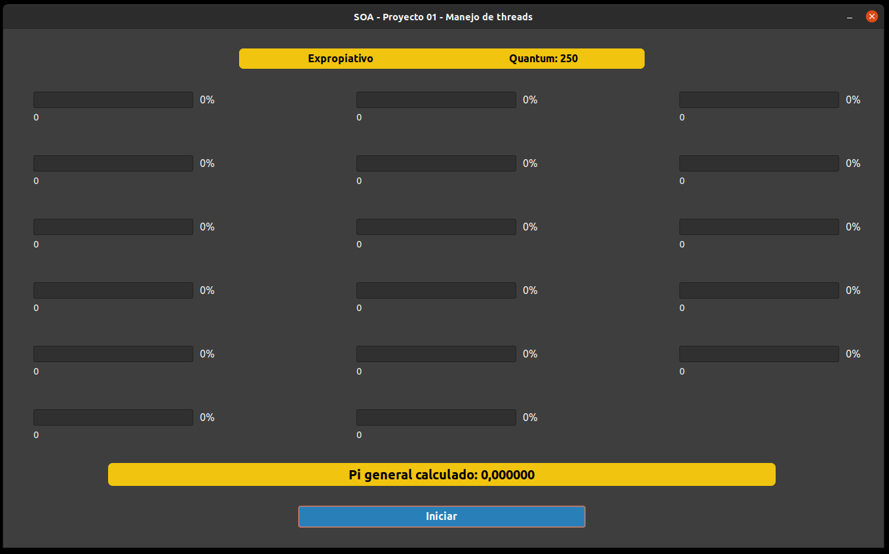
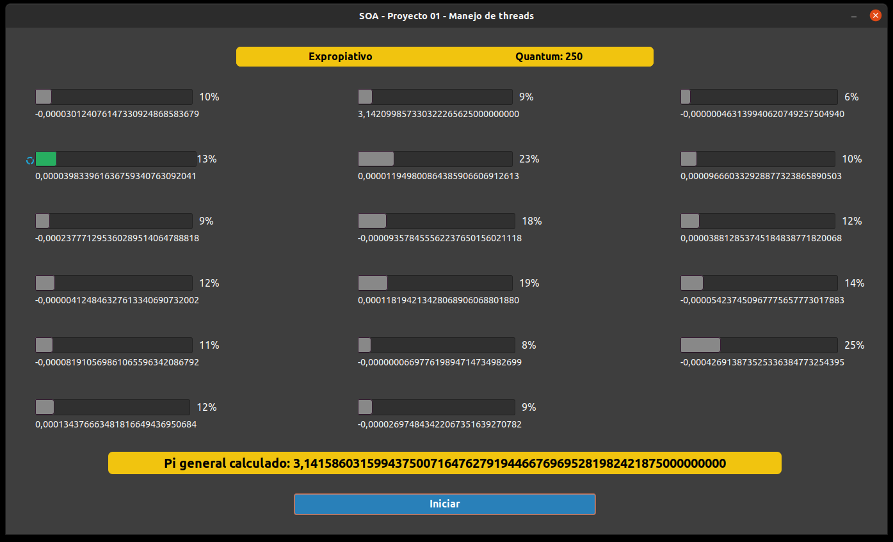
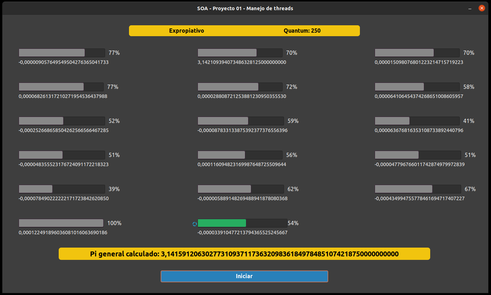
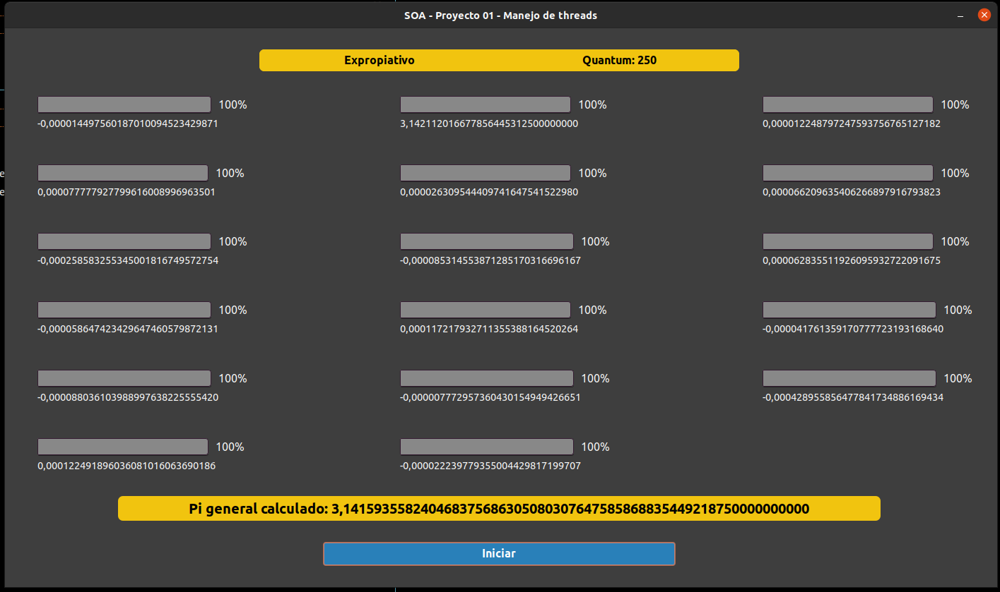

# Proyecto 1

Del curso **Sistemas Operativos Avanzados**, de la Maestría de Ciencias de la Computación del Tecnológico de Costa Rica.

Profesor:
  Dr. Francisco Torres Rojas

Integrantes:
  - Nicole Carvajal Barboza 2017098785
  - Rubén González Villanueva 2017118764
  - Edisson López 2013103311
  - Otto Mena Kikut 2021582208
  - Cristina Soto Rojas 2021582215

# Compilar

Para compilar utilizar el siguiente comando:

 ```gcc -o gladewin main.c -lm -Wall `pkg-config --cflags --libs gtk+-3.0` -export-dynamic```

# Ejecutar

Para ejecutar el programa:

 ```./gladewin```

# Parámetros

 El archivo recibe los parámetros del archivo input.txt que tiene la siguente estructura:

 - Primera línea: 1 si es expropiativo, 0 si es no expropiativo.
 - Segunda línea: Cantidad de threads.
 - Tercera línea: Cantidad de boletos para cada thread (número entero).
 - Cuarta línea: Cantidad de trabajo para cada thread.
 - Quinta línea: Quantom (para la versión expropiativa) o porcentaje de trabajo asignado (para la versión no expropiativo).

# Capturas del programa

Se mostrará el progreso del programa en 4 pasos, con el caso de:
- Expropiativo
- 17 threads
- Quantum de 250

Para ésto se define el archivo input.txt con la siguiente estructura:
```
1
17
10 11 12 13 14 10 11 12 13 14 10 11 12 13 14 13 13
1100 1200 1300 1400 1500 1100 1200 1300 1400 1500 1100 1200 1300 1400 1500 1300 1300
250
```

## Capturas:





